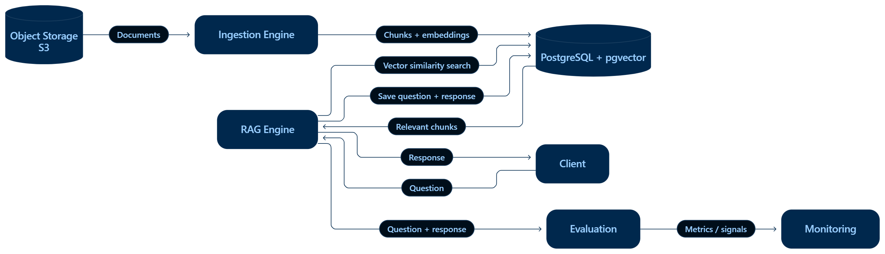

# Production RAG Platform

A production-oriented Retrieval-Augmented Generation (RAG) platform for exploring how organizational knowledge can be made easier to retrieve, evaluate, and use reliably.

## Why this project?

Large organizations accumulate substantial amounts of operational knowledge over time: technical documentation, incident records, logs, troubleshooting notes, postmortems, and lessons learned.

When a new problem appears, finding the relevant knowledge from this growing collection can be surprisingly difficult. The information may exist somewhere in the organization, but retrieving the right context at the right time is often slow and highly dependent on manual searching.

This led me to a broader question:

> **Can a well-engineered RAG system turn accumulated organizational knowledge into something that is easier to search, reason over, and learn from?**

This project is my attempt to explore that question from an engineering perspective.

Rather than treating RAG as simply *"retrieve some chunks and send them to an LLM"*, I am designing the system as a complete pipeline where retrieval quality, evaluation, reliability, and observability are first-class concerns.

---

## What I am building

The platform is designed to support an end-to-end knowledge retrieval workflow:

1. Documents and organizational knowledge are uploaded to object storage.
2. An ingestion service processes and prepares the documents for retrieval.
3. Documents are transformed into embeddings and stored in a vector store.
4. A RAG engine retrieves relevant knowledge in response to a user question.
5. The retrieved context is passed to an LLM to generate an evidence-based response.
6. Questions and generated responses are persisted for traceability and analysis.
7. Generated responses are evaluated using dedicated evaluation components.
8. Evaluation and runtime signals can feed monitoring and future improvements.

The architecture is intentionally modular so that individual components can be tested, evaluated, and improved independently.

---

## Architecture

The current architecture separates the main responsibilities of the system into distinct components:

- **Object Storage** — stores the original documents and source artifacts.
- **Ingestion Engine** — reads documents, processes them, creates retrieval-ready representations, and persists the resulting data.
- **Vector Database** — stores embeddings used for semantic retrieval.
- **PostgreSQL** — stores application data, metadata, and question/answer records.
- **RAG Engine** — handles retrieval and response generation.
- **Evaluation** — evaluates generated responses and retrieval behavior.
- **Monitoring** — provides a foundation for observing system behavior and identifying areas for improvement.
- **Client** — provides the interface through which users submit questions and receive responses.

The architecture will evolve as implementation and experimentation reveal new requirements.

---

## Core Features

### Document ingestion

- PDF, DOCX, and TXT document support
- Object-storage-based document management
- Document processing and preparation for retrieval
- Embedding generation
- Vector storage

### Retrieval-Augmented Generation

- Semantic retrieval
- Vector similarity search
- Context-aware response generation
- Source-aware responses
- Persistent question/answer records

### Evaluation

The system is designed to treat evaluation as a core part of the RAG pipeline rather than an afterthought.

Planned evaluation capabilities include:

- Retrieval quality evaluation
- Response quality evaluation
- LLM-as-a-Judge
- Groundedness / faithfulness assessment
- Evaluation datasets and repeatable experiments

### Reliability and guardrails

Planned reliability components include:

- Hallucination mitigation
- Retrieval failure handling
- Response validation
- Context and source checks
- Guardrails around generated responses

### Observability

The platform is being designed with observability in mind so that system behavior can be analyzed across:

- Retrieval
- Generation
- Evaluation
- Latency
- Errors
- User questions and responses

---

## Design Principles

The project is guided by several principles:

### 1. RAG is a system, not a prompt

A useful RAG application depends on much more than the choice of LLM.

Retrieval strategy, document processing, embeddings, context construction, evaluation, failure handling, and observability all influence the final system.

### 2. Evaluate before optimizing

Instead of assuming that a change improves the system, I want to make improvements measurable through repeatable evaluation.

### 3. Separate retrieval from generation

The system should make it possible to investigate whether a poor answer originates from:

- retrieving the wrong information,
- retrieving insufficient context,
- constructing the context poorly,
- or generating an incorrect response from otherwise relevant evidence.

### 4. Design for iteration

The architecture is intentionally modular so that components and strategies can be replaced and compared as experiments evolve.

### 5. Reliability matters as much as capability

A system that produces impressive answers occasionally is not necessarily useful in an organizational setting.

The goal is to understand and improve the conditions under which the system can produce reliable, evidence-based responses.

---

## Technology Stack

| Layer | Technology |
|---|---|
| Language | Python |
| Backend | FastAPI |
| Database | PostgreSQL |
| Vector Store | pgvector |
| Object Storage | S3-compatible storage |
| Containerization | Docker |

> The technology stack will evolve as the project progresses.

---

## Development Roadmap

The project is being developed incrementally.

### Phase 1 — Foundation

- [x] Initial system architecture
- [x] Project structure
- [x] Dockerized development environment
- [x] PostgreSQL setup
- [x] Object storage integration

### Phase 2 — Ingestion

- [x] Document upload
- [x] PDF / DOCX / TXT processing
- [x] Document chunking
- [x] Embedding generation
- [x] Vector storage
- [x] Document metadata

### Phase 3 — Retrieval & RAG

- [x] Semantic retrieval
- [x] Retrieval pipeline
- [ ] Context construction
- [ ] LLM integration
- [ ] Source-aware responses
- [ ] Question/answer persistence

### Phase 4 — Evaluation

- [ ] Evaluation dataset
- [ ] Retrieval evaluation
- [ ] Response evaluation
- [ ] LLM-as-a-Judge
- [ ] Groundedness / faithfulness evaluation
- [ ] Experiment tracking

### Phase 5 — Reliability

- [ ] Hallucination mitigation
- [ ] Retrieval failure handling
- [ ] Response validation
- [ ] Guardrails
- [ ] Reliability experiments

### Phase 6 — Observability & Monitoring

- [ ] Structured logging
- [ ] RAG pipeline tracing
- [ ] Latency monitoring
- [ ] Error monitoring
- [ ] Evaluation monitoring
- [ ] Retrieval and response analytics

---

## Current Status

🚧 **Work in Progress**

This project is under active development.

The current stage focuses on establishing the system architecture and implementing the foundation for document ingestion, semantic retrieval, and the core RAG pipeline.

Evaluation, reliability, and monitoring components will be introduced progressively.

The architecture and implementation may change as experiments reveal new requirements or better approaches.

---

## What I am exploring

This project is not intended to be a fixed implementation of a single RAG recipe.

Some of the questions I am exploring include:

- How should organizational documents be chunked for different retrieval scenarios?
- How much does retrieval strategy influence final answer quality?
- When does semantic retrieval fail, and how can those failures be detected?
- How can retrieval quality be evaluated independently from generation quality?
- How can we distinguish retrieval failure from generation failure?
- How can an evaluation pipeline guide engineering decisions rather than simply produce a score?
- What signals are useful for monitoring a RAG system in production?
- How should a RAG system behave when the available knowledge is insufficient to answer a question?

These questions will shape the next stages of the project.

---

## Project Philosophy

The project is intentionally being developed as an engineering exploration rather than a tutorial implementation.

I am designing the architecture, choosing the components, testing assumptions, and refining the system as new problems emerge.

The objective is not simply to demonstrate that an LLM can answer questions over documents.

The objective is to understand what is required to build a **reliable knowledge retrieval system around an LLM**.

---

## License

This project is licensed under the MIT License.